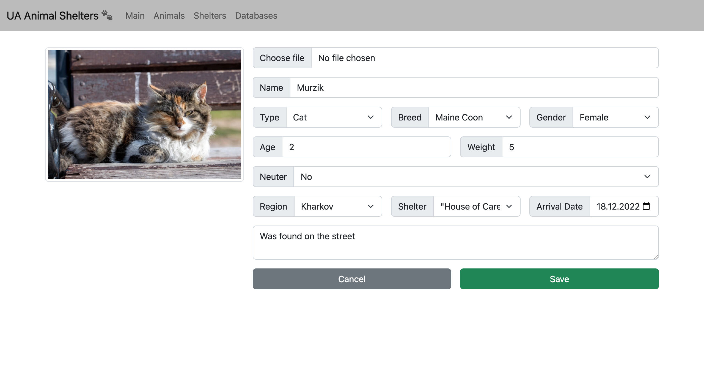

# Ukrainian Animal Shelters

## Vision
"Ukrainian Animal Shelters" is a web-application that allows users to record and view information about animals and shelters.

Application should provide:
- Storing animals and shelters in a database;
- Display list of animals;
- Updating the list of animals (adding, editing, removing);
- Display list of shelters;
- Updating the list of shelters (adding, editing, removing);
- Display information about animals;
- Display information about shelters and animals that are there;
- Filtering and searching for animals;
-  Filtering and searching for shelters.

## 1. Animals
### 1.1 Display list of animals
**_Main scenario:_**
- User selects item “Database”;
- User selects the section "Animal Database";
- Application displays list of Animals.

Pic. 1.1 View the Animals list.

The list displays the following columns:
- ID - unique animal number;
- Image - animal image;
- Name - animal name;
- Type - type of animal (cat or dog);
- Breed - animal breed;
- Gender - sex of the animal;
- Age - animal age; 
- Weight - animal weight;
- Neuter - castrated animal (Yes or No);
- Region - where is the animal from; 
- Shelter - what shelter is the animal;
- Arrival Date - when the animal arrived at the shelter;
- Animal History - where or what happened to the animal.

**_Filtering:_**
- In animal list view mode, the user can set a filter for almost all columns (Type, Breed, Gender etc.) and then click on the "Filter search" button to search (at the bottom of the filter);
- The application displays a form for viewing the list of animals according to the filtering.

**_Search:_**
-  In animal list view mode, the user can a search in the Search line for an occurrence of a specific word or phrase;
-  The application displays a form for viewing the list of animals according to the searching.

### 1.2 Add animal
**_Main scenario:_**
- User clicks the “Add an Animal” button in the animal list view mode;
- Application displays form to enter animal data;
- User enters animal data and presses “Save” button;
- If any data is entered incorrectly, incorrect data messages are displayed;
- If entered data is valid, then record is adding to database;
- If error occurs, then error message is displaying;
- If new animal record is successfully added, then list of animal with added records is displaying.

**_Cancel operation scenario:_**
- User clicks the “Add an Animal” button in the animal list view mode;
- Application displays form to enter animal data;
- User enters animal data and presses “Cancel” button;
- Data don’t save in data base, then list of animals records is displaying to user.
- Data will not be saved to the
database and the corresponding form with updated data will be opened.

Pic. 1.2 Add animal.

When adding a order, the following details are entered:
- Choose file - animal image;
- Name - animal name;
- Type - type of animal (cat or dog);
- Breed - animal breed;
- Gender - sex of the animal;
- Age - age of the animal in years;  
- Weight - animal weight in kilograms; 
- Neuter - castrated animal (Yes or No);
- Region -  where is the animal from; 
- Shelter - what shelter is the animal;
- Arrival Date -  when the animal arrived at the shelter;
- Animal History - where or what happened to the animal.

### 1.3 Edit animal
**_Main scenario:_**
- User clicks the “Edit” button in the animal list view mode;
- Application displays form to enter animal data;
- User enters animal data and presses “Save” button;
- If any data is entered incorrectly, incorrect data messages are displayed;
- If entered data is valid, then record is adding to database;
- If error occurs, then error message is displaying;
- If new animal record is successfully added, then list of animal with added records is displaying.

**_Cancel operation scenario:_**
- User clicks the “Edit” button in the animal list view mode;
- Application displays form to enter animal data;
- User enters animal data and presses “Cancel” button;
- Data don’t save in data base, then list of animals records is displaying to user.
- Data will not be saved to the
database and the corresponding form with updated data will be opened.

Pic. 1.3 Edit animal.

When adding a order, the following details are entered:
- Choose file - animal image;
- Name - animal name;
- Type - type of animal (cat or dog);
- Breed - animal breed;
- Gender - sex of the animal;
- Age - age of the animal in years;  
- Weight - animal weight in kilograms; 
- Neuter - castrated animal (Yes or No);
- Region -  where is the animal from; 
- Shelter - what shelter is the animal;
- Arrival Date -  when the animal arrived at the shelter;
- Animal History - where or what happened to the animal.

### 1.4 Removing the animal
**_Main scenario:_**
- The user, while in the list of animal, presses the "Delete" button in the selected animal line;
- If the animal can be removed, a confirmation dialog is displayed;
-  The user confirms the removal of the animal;
-  Record is deleted from database;
-  If error occurs, then error message displays;
-  If animal record is successfully deleted, the list of animal without deleted records is displaying.

Pic. 1.4 Delete animal dialog.

**_Cancel operation scenario:_**
- The user, while in the list of animal, presses the "Delete" button in the selected animal line;
- If the animal can be removed, a confirmation dialog is displayed;
- User press “Cancel” button;
- List of animal without changes is displaying.

## 2. Shelters
### 2.1 Display list of shelters
**_Main scenario:_**
- User selects item “Database”;
- User selects the section "Shelter Database";
- Application displays list of Shelters.

Pic. 2.1 View the Shelters list.

The list displays the following columns:
- ID - unique shelter number;
- Image - shelter image;
- Name - shelter name;
- Region - the region in which the shelter is located; 
- City - the city in which the shelter is located;
- Street - the street where the shelter is located;
- Phone - shelter phone number;
- Email - shelter email;
- Website - shelter website.

**_Filtering:_**
- In shelter list view mode, the user can set a filter for Region and City columns and then click on the "Filter search" button to search (at the bottom of the filter);
- The application displays a form for viewing the list of shelters according to the filtering.

**_Search:_**
-  In shelter list view mode, the user can a search in the Search line for an occurrence of a specific word or phrase;
-  The application displays a form for viewing the list of shelters according to the searching.

### 2.2 Add shelter
**_Main scenario:_**
- User clicks the “Add an Shelter" button in the shelter list view mode;
- Application displays form to enter shelter data;
- User enters shelter data and presses “Save” button;
- If any data is entered incorrectly, incorrect data messages are displayed;
- If entered data is valid, then record is adding to database;
- If error occurs, then error message is displaying;
- If new shelter record is successfully added, then list of shelter with added records is displaying.

**_Cancel operation scenario:_**
- User clicks the “Add an Shelter" button in the shelter list view mode;
- Application displays form to enter shelter data;
- User enters shelter data and presses “Cancel” button;
- Data don’t save in data base, then list of shelters records is displaying to user.
- Data will not be saved to the
database and the corresponding form with updated data will be opened.

Pic. 2.2 Add shelter.

When adding a order, the following details are entered:
- Choose file - shelter image;
- Name - shelter name;
- Region - the region in which the shelter is located; 
- City - the city in which the shelter is located;
- Street - the street where the shelter is located;
- Phone - shelter phone number;
- Email - shelter email;
- Website - shelter website.

### 2.3 Edit shelter
**_Main scenario:_**
- User clicks the “Edit” button in the shelter list view mode;
- Application displays form to enter shelter data;
- User enters shelter data and presses “Save” button;
- If any data is entered incorrectly, incorrect data messages are displayed;
- If entered data is valid, then record is adding to database;
- If error occurs, then error message is displaying;
- If new shelter record is successfully added, then list of shelter with added records is displaying.

**_Cancel operation scenario:_**
- User clicks the “Edit” button in the shelter list view mode;
- Application displays form to enter shelter data;
- User enters shelter data and presses “Cancel” button;
- Data don’t save in data base, then list of shelter records is displaying to user.
- Data will not be saved to the
database and the corresponding form with updated data will be opened.

Pic. 2.3 Edit shelter.

When adding a order, the following details are entered:
- Choose file - shelter image;
- Name - shelter name;
- Region - the region in which the shelter is located; 
- City - the city in which the shelter is located;
- Street - the street where the shelter is located;
- Phone - shelter phone number;
- Email - shelter email;
- Website - shelter website.

### 2.4 Removing the shelter
**_Main scenario:_**
- The user, while in the list of shelter, presses the "Delete" button in the selected shelter line;
- If the shelter can be removed, a confirmation dialog is displayed;
-  The user confirms the removal of the shelter;
-  Record is deleted from database;
-  If error occurs, then error message displays;
-  If shelter record is successfully deleted, the list of shelter without deleted records is displaying.

Pic. 2.4 Delete shelter dialog.

**_Cancel operation scenario:_**
- The user, while in the list of shelter, presses the "Delete" button in the selected shelter line;
- If the shelter can be removed, a confirmation dialog is displayed;
- User press “Cancel” button;
- List of shelter without changes is displaying.